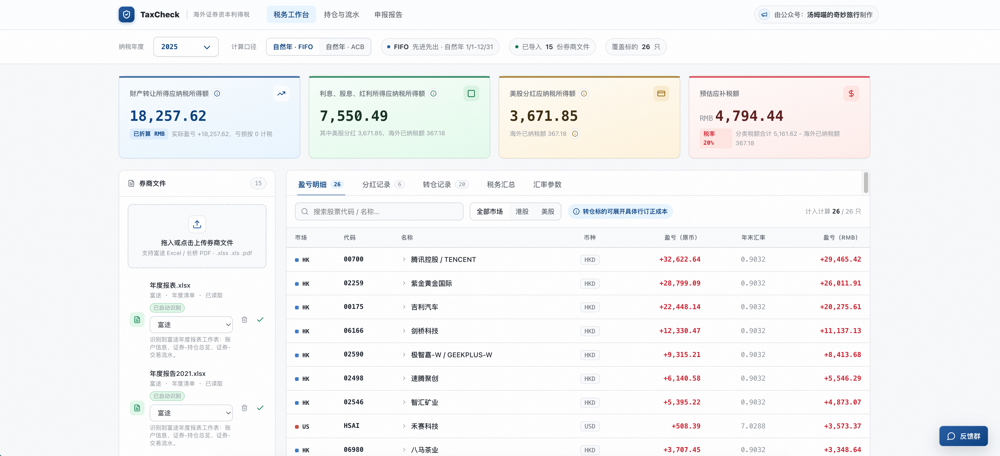
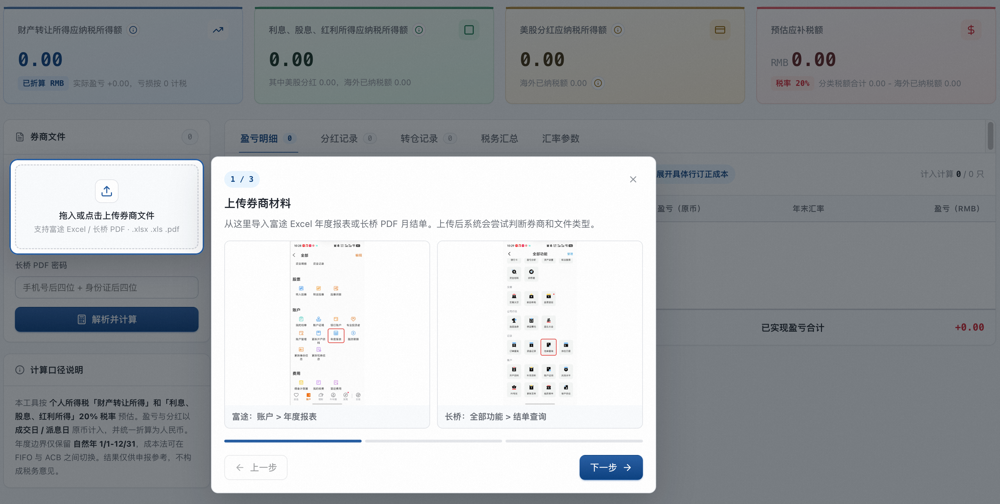
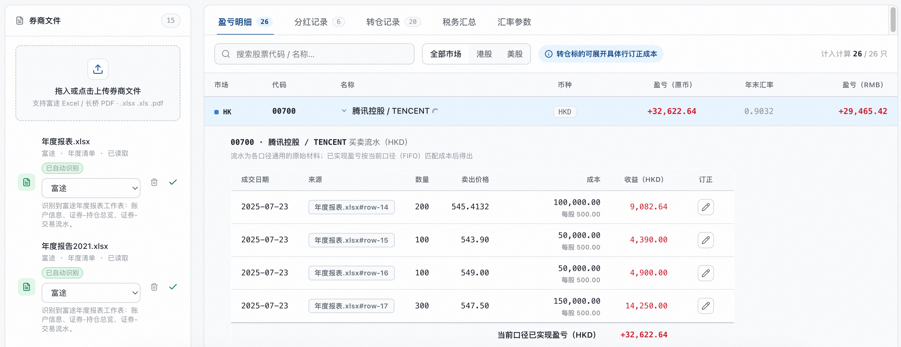
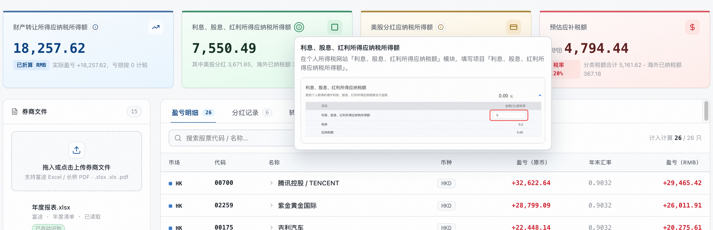
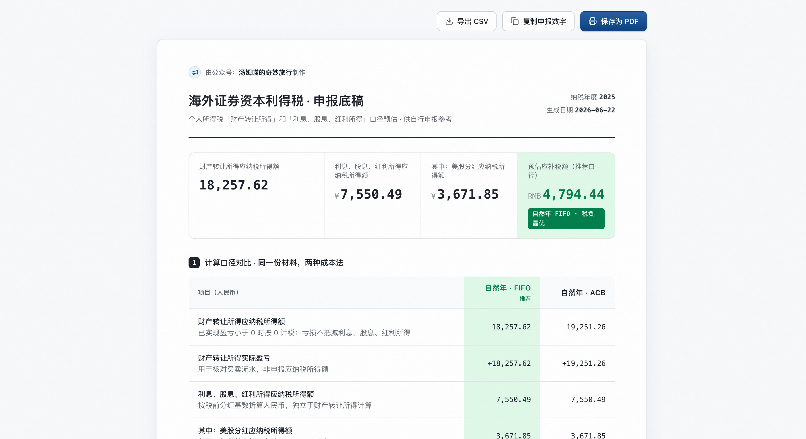
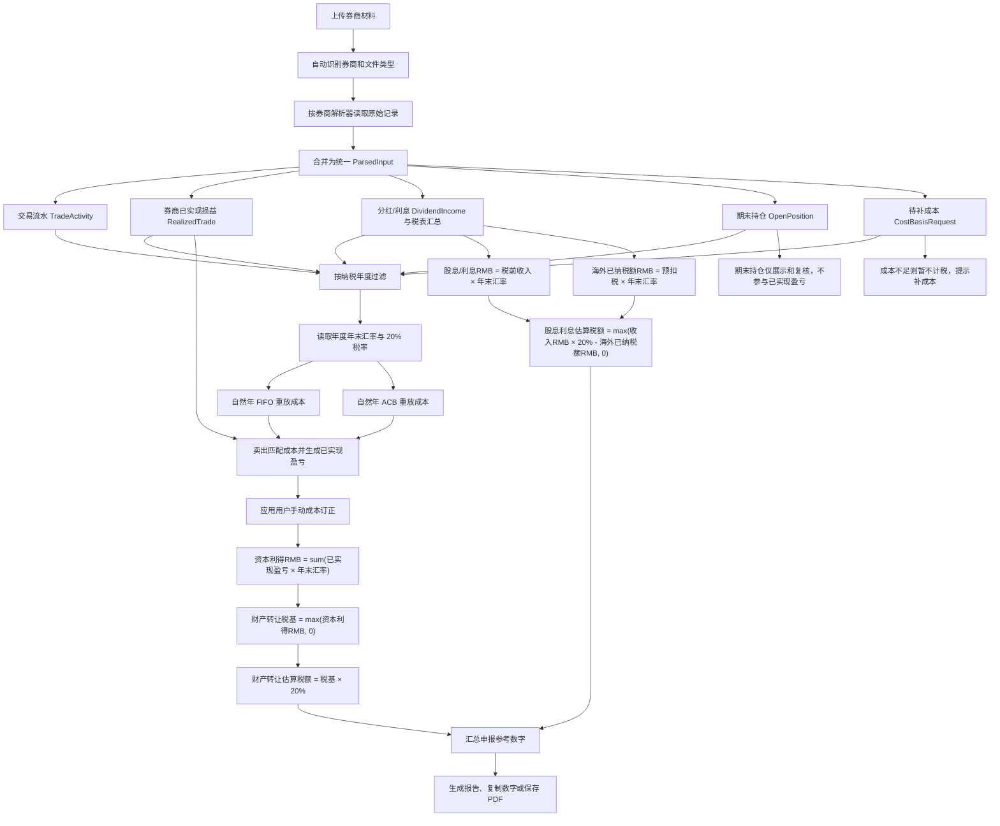

# TaxCheck

TaxCheck 是快速为中国大陆居民打造的免费海外资本利得税计算工具，支持把海外证券券商文件整理成个人申报参考底稿。

在线使用：[https://tomczhang.github.io/tax-check/](https://tomczhang.github.io/tax-check/)

## 支持券商与材料

| 券商 / 机构 | 支持材料 | 可解析内容 | 备注 |
| --- | --- | --- | --- |
| 富途 | “年度报表”Excel（`.xlsx` / `.xls`） | 交易流水、做空开平仓、分红、拆并股、证券转入/转出、期末持仓 | 富途目前只接受年度报表；利息表、成交明细、资产流水等单独文件会提示删除后重新解析。 |
| 长桥 | PDF 月结单；股票账户明细 Excel（`.xlsx` / `.xls`） | PDF 可解析股票交易、现金分红与预扣税、证券转入/转出、期末持仓、待补成本；股票账户明细 Excel 可读取多年股数流水用于核对 | 加密 PDF 需填写密码；支持上传跨月材料补齐历史成本。股票账户明细不含成交金额，会排除出盈亏/税额计算。 |
| 熊猫 | PDF 月结单 | 股票交易、现金分红与预扣税、证券转入/转出、期末持仓、待补成本 | 复用长桥月结单结构解析；加密 PDF 需填写密码。 |
| 招商永隆 | Annual Income Report / 全年收入报告 PDF；证券账户月结单 PDF | 年度报告读取股息/利息汇总；月结单读取交易、分红、期末持仓并重放成本 | 同时上传年度报告和月结单时，系统优先使用月结单逐笔明细，年度报告用于人工核对，不重复计入。 |
| 卓锐 | PDF 月结单 | 股票交易、基金申赎、资金流水、证券提存、分红、期末持仓 | 加密 PDF 需填写密码；月初持仓成本会按月结单成本价暂估并提示复核。 |
| 盈立 | PDF 月结单 | 股票交易、现金流水/分红、期末持仓、待补成本 | 支持港股、美股与人民币币种识别；如 PDF 加密可填写密码。 |
| 老虎 | PDF 税表；PDF 活动报表 | 税表汇总、股票/基金交易、券商已实现损益、分红与预扣税 | 活动报表中的“已实现的损益”会作为券商报告口径计入。 |
| IBKR / 盈透证券 | PDF Activity Statement / 活动账单 | 股票交易、券商已实现损益、应计股息、预扣税、期末持仓 | 外汇和短债记录不会计入股票资本利得。 |



## 这个工具解决什么问题

海外券商导出的交易、分红、转仓材料通常分散在不同报表里，个人申报时还需要手动整理成本、汇率、应纳税所得额和海外已纳税额。TaxCheck 把这些步骤放在一个本地浏览器工具里完成：

- 导入券商材料。
- 识别券商和文件类型。
- 计算财产转让所得与利息、股息、红利所得。
- 对比自然年 FIFO / ACB 两种成本法。
- 核对逐笔交易、补充历史成本、订正解析结果。
- 生成可复制数字和可保存 PDF 的申报参考底稿。

## 使用流程

### 1. 根据引导上传券商材料

新手引导会提示富途年度报表、长桥/盈立等月结单的入口位置，并引导完成上传、解析和生成报告。



### 2. 展开单只股票核对每笔交易

盈亏明细支持展开到每笔卖出记录，核对成交日期、卖出价格、成本、收益，也可以对历史成本或解析成本进行订正。



### 3. 查看个税网站填写位置

关键指标旁提供填写位置说明，hover 后可以看到对应个人所得税网站模块和字段，减少来回查表。



### 4. 生成申报参考底稿

申报报告会汇总两种成本法的结果、推荐口径、财产转让所得、利息股息红利所得、美股分红抵扣材料和数据来源。可以复制申报数字，也可以保存为 PDF 留档。



## 主要功能

- 导入富途、长桥、熊猫、招商永隆、卓锐、盈立、老虎、IBKR 等券商材料。
- 自动识别券商和文件类型，减少手动选择。
- 按纳税年度筛选，支持 2021-2025 年。
- 计算财产转让所得应纳税所得额。
- 计算利息、股息、红利所得应纳税所得额。
- 单独列示美股分红应纳税所得额和海外已纳税额。
- 对比自然年 FIFO 和自然年 ACB 两种成本法。
- 支持历史成本缺失时手动补充成本，或对已解析成本进行逐笔订正。
- 支持拆并股和现金碎股记录重放成本，避免期末持仓被误判为无成本。
- 支持转仓记录查看，并在盈亏明细中展示成本缺口链路，辅助判断是否还需要上传其他券商材料或补充原始成本。
- 生成申报报告，可复制申报数字或保存为 PDF。

## 材料使用建议

- 最佳实践：把同一纳税年度及相关历史年度里能找到的券商材料尽量一次性全部上传，让系统跨券商、跨月份整体分析。不要先按单个券商分别计算后再手工合并；整体分析更容易把卖出和对应买入、转仓、拆并股记录连起来，减少不必要的待补成本和人工订正。
- 同一纳税年度有卖出或分红时，请上传该年度覆盖卖出/分红月份的材料。
- 如果卖出标的的买入发生在更早年度或转仓前，请一起上传更早月份/年度材料，或在“待补成本”里补入总成本或每股成本。
- 如果期末持仓来自券商间转仓，盈亏明细会标出转入/转出日期、数量和来源文件；券商材料没有提供原始成本时，系统会说明这是转仓链路导致的成本缺口。
- 如果持仓来自同一券商历史买入后的拆并股，系统会按拆并股比例折算剩余成本；只有缺少买入或转入原始成本时才提示补充。
- 如果同一份文件重复上传，系统会按文件指纹拦截，避免重复计入。
- 对 PDF 文本层不完整导致的待补代码、成本缺失，可以在盈亏明细里人工复核并重算。

## 数据隐私

TaxCheck 承诺不保存任何你的财务数据。上传的券商文件只在浏览器本地解析和计算，不会上传到服务器。

项目使用 Umami 做匿名访问统计，用于了解页面访问量和报告生成次数，不采集券商文件内容、交易明细或个人财务数据。

## 计算口径

- 纳税年度按自然年 1 月 1 日至 12 月 31 日。
- 支持 2021-2025 年，汇率采用对应年度年末人民币汇率中间价口径。
- 税率按个人所得税「财产转让所得」和「利息、股息、红利所得」20% 估算。
- 财产转让所得按年度净额口径估算：同一年度内已实现资本利得和亏损先合并，税基为 `max(年度资本利得RMB, 0)`。
- 股息、利息按收入项目单独计算：税基为税前收入折人民币，海外预扣税作为抵免参考，估算税额为 `max(股息利息RMB × 20% - 海外已纳税额RMB, 0)`。
- 财产转让所得和利息、股息、红利所得分项计算，资本亏损不抵减分红所得。
- FIFO 按先进先出匹配成本，ACB 按平均成本匹配成本。系统会同时生成两种结果，当前默认推荐自然年 ACB 作为更平滑的自查口径。
- 老虎、IBKR 等材料如果提供券商已实现损益，系统会保留券商报告口径，不再用交易流水二次重放同一笔成本。
- 同一股票在多个券商同时持有时，成本重放按券商账户分别进行，汇总展示仍按股票代码合并，避免一个券商的待补成本影响另一个券商已识别成本的持仓。
- 拆并股只调整持仓数量和单位成本，不产生已实现盈亏；现金碎股会按对应比例释放成本并计入已实现盈亏。
- 券商间转仓如果没有携带原始成本，会作为成本缺口展示，不会自动把转入数量当作零成本买入。
- 期末持仓和未实现盈亏只用于核对，不计入财产转让所得；卖出发生后才进入应税盈亏计算。

提示：申报时请保持同一种成本法，不能今年用 FIFO、明年用 ACB，否则可能引起税务核查。

### 计算逻辑图



## 本地开发

```bash
npm install
npm run dev
```

本地访问：

```text
http://127.0.0.1:5173/
```

构建：

```bash
npm run build
```

预览构建产物：

```bash
npm run preview
```

## 部署

项目通过 GitHub Actions 部署到 GitHub Pages。

推送到 `main` 分支后会自动执行：

1. `npm ci`
2. `npm run build`
3. 上传 `dist`
4. 发布到 GitHub Pages

部署配置见 [.github/workflows/deploy-pages.yml](.github/workflows/deploy-pages.yml)。

## 环境变量

GitHub Pages 构建时可配置以下 Repository Variables：

- `UMAMI_SCRIPT_URL`
- `UMAMI_WEBSITE_ID`

本地开发不配置也可以正常运行，只是不会上报 Umami 统计。

## 免责声明

TaxCheck 生成的结果仅供个人申报参考与自查，不构成税务、会计或法律意见。最终申报口径与税额请以主管税务机关要求及专业税务顾问意见为准。

## 友情链接

- [linux.do](https://linux.do/)：中文 AI 学习 & 开发者论坛。

## 制作

本工具由公众号「汤姆喵的奇妙旅行」制作。
